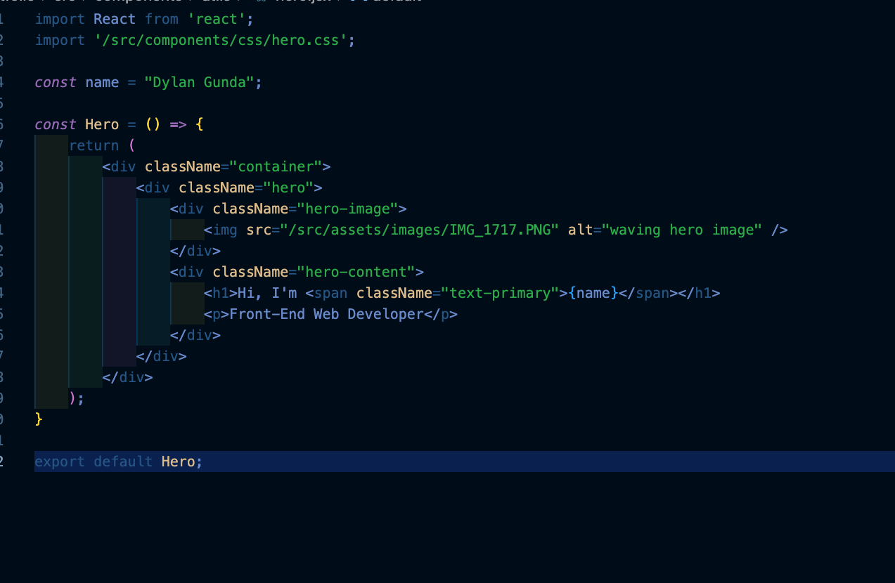
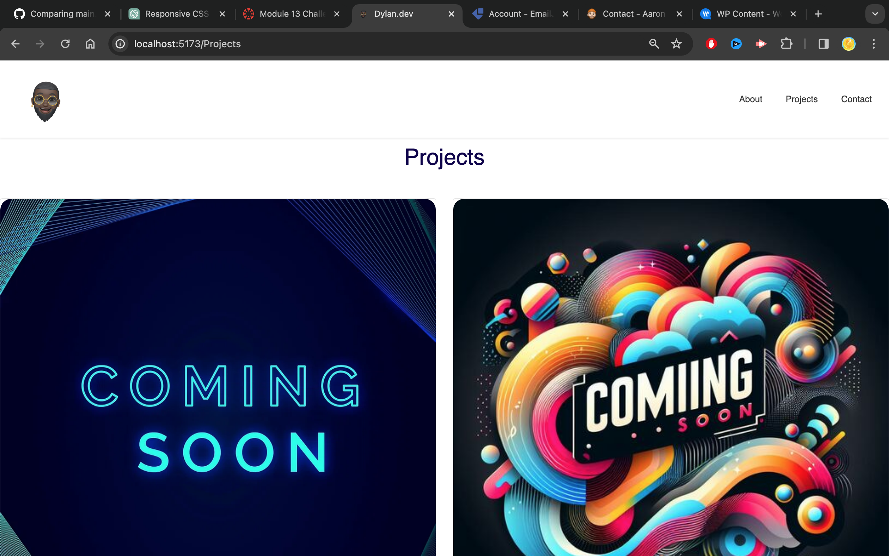

# bootstrap-portfolio
# My-Portfoolio

## Table of Contents: 
* [Installation](#installation)
* [Usage](#usage)
* [Credits](#credits)
* [License](#license)

Installation: 

Similar to the original Portfolio tasks, the steps to creating the repo remain the same, however, since this Portfolio was made with React, the installation of the code space varied slightly.

Step 1: Creating a Repo. 

// to create a repo log into the Github account and select the option to create a repo ensuring that the "add Readme file" box is ticked. 

// Once the repo was created cloning the repo on the terminal using "git clone "<SSH link>"

Step 2: creting the folders and files for the repo:

// Once the repo was created, a Vite react template was creating using Node.js. 

Step 3: Wireframing: 

// All great designs begin as an idea, with this in mind , I spent some time thinking of how i want the pages to look and how this would be best achieved, I made the wireframe usign FIGMA, from the previous Portfolio, some ideas were kept but the whole portfolio was reimagined, given the level of progress made since learning how to use HTML, CSS & bootstrap.

FOllowing this, a follow up wireframe was completed with a much more fleshed out idea, taking inspiration from something that we all use everyday.

Step 3: Creating the code: 

// Since the task was to create a portfolio with no previous code using React and a combination of all of the previous lessons, once the idea was complete, I was tasked with completing research to understand how to create the indivdidual pieces of the pages, this was done through research on Youtube as well as mdn web docs_ and using the bootstrap website to pick the items that best match the wireframe and the idea for the portfolio.

Step 4: Creating a React file: 

// I began by adding the skeleton from the wireframe and setting up the desired pages, following this, i spent time building each compoenent and styling to create an overall professional website, the components were seperated as much as possible for the purpose of being able to make future changes easier. In addition to this, once styling had begun, it would also be easier to see the changes made and if I like the changes or any alterations were needed.

// Furthermore, creating components, helped to visualise each section and understand developing a better understanding of where something was not working if an error occurs or the page is behaving in an unexpected manor. It also made it easier to read the code. 

Step 5: Creating the CSS stylesheet: 

// Given the overhaul, it was not possibe to utilise the CSS sheets from the previous portfolio, I elected to start the CSS file from scratch to sharpen the tools, I began by using the CSS file and starting from the nav and working through the page, section by section.

Usage: 

    the page will be used as my portfolio, where all of my future projects will live, in additon to this, as the my skills improve and evolve, my portfolio will continue to evolve and reflect my aquired skills, there are currently no project within the page or the project cards, whilst we hae completed a number of projects, i felt it would be appropriate to refactor the code, poslish the projects and bring them in line with my current skill capabilities, one this is done, the project page will be updated.

Credits: 

    Repo is made by myself, idea for the sliding projects as well as the nav bar and the resume section came from reviewing the bootstrap website.
    
    All ammendedments and work completed thereafter was completed independently with a lot of research and a lot more youtube videos as well as referencing lessongs from the bootcamp

License:

    See License in Repo